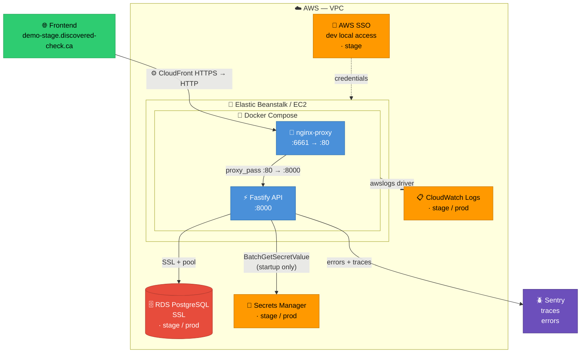

# 🚀 Demo Platform

Demo Platform is a **concept project** showcasing a distributed, full stack web application using type-safe JavaScript and built within a platform **monorepo**.

The goal of this project is to demonstrate modern **full-stack web development practices**, from frontend and backend to cloud infrastructure and developer experience.  

---

## 🖥️ Frontend Application

*Coming soon!*  
This section will include a modern frontend application (e.g., **React/Next.js**) integrated with the backend API.  

---

## ⚙️ Backend API



### 🏛️ Core Features

- 🐳 Docker containerization
- 🔗 RESTful API design  
- 🟢 Node.js + TypeScript  
- ⚡ Fastify framework  
- 📄 OpenAPI (JSON schema + docs)  
- 🗄️ PostgreSQL database

### 🧪 Developer Experience

- 🔧 Configurable API environments (local and remote)
- ✅ Integration testing with **Vitest**
- 📊 Observability: Sentry errors + tracing
- 🤖 GitHub action CI/CD

### ☁️ Cloud Infrastructure (AWS)

- 🗄️ RDS (PostgreSQL)
- ⚙️ CloudFront
- 🚀 Elastic Beanstalk / EC2 for deployment
- 🔑 Secrets Manager
- 📋 Cloudwatch for logging
- 🔐 AWS SSO for authentication

[Read more here ...](/api-demo/README.md)

---

## 📌 Future Improvements

- 🖥️ Frontend implementation  
- 🏗️ Infrastructure as Code (Terraform/CDK)  
- 🎨 UI/UX polish and sample data  

---

## 🏗️ Monorepo Structure (Planned)

```text
/app-demo # Frontend application
/api-demo # Backend API service
/shared   # Shared libraries & utilities
