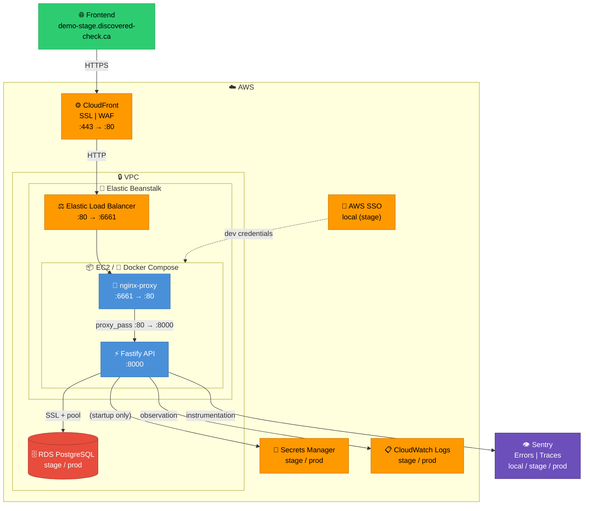

# 🚀 Demo Platform

Demo Platform is a **concept project** showcasing a distributed, full stack web application using type-safe JavaScript and built within a platform **monorepo**.

The goal of this project is to demonstrate modern **full-stack web development practices**, from frontend and backend to cloud infrastructure and developer experience.  

---

## 🖥️ Frontend Application

A **single-page application** the browser loads and runs — delivered as fingerprinted static assets over a CDN. It's the UI for the API: a cookie-authenticated app with a `/login` screen and a guarded `/home`, built on the stack below.

### 🏛️ Frontend Features

- ⚛️ React 19 + TypeScript (strict)
- ⚡ Vite build tooling (Rolldown/Oxc)
- 🧭 TanStack Router (guarded routes) + TanStack Query (server state)
- 🎨 Ant Design UI + CSS Modules with type-checked class names
- 🔐 HttpOnly-cookie auth with transparent token refresh
- 🧪 Vitest + React Testing Library, with a mock API generated from the API's OpenAPI schema
- 👁️ Sentry — errors, Web Vitals, cross-tier tracing
- 🔗 Shared types with the API via the `#shared` alias
- 🤖 GitHub Actions CI/CD

### ☁️ Frontend Hosting (AWS)

- 🪣 S3 static hosting (origin)
- ⚙️ CloudFront (CDN + SSL)

> Follow-up: client-side routing is now live, so deep links need a CloudFront SPA fallback (403/404 → `index.html`) before the app ships publicly — see the [app-demo README](./app-demo/README.md).

[Read more here ...](./app-demo/README.md)

---

## ⚙️ Backend API


```mermaid
flowchart TD
    Client["🌐 Frontend<br/>demo-stage.discovered-check.ca"]

    subgraph AWS["☁️ AWS"]
        CF["⚙️ CloudFront<br/>SSL | WAF<br/>:443 → :80"]
        subgraph VPC["🔒 VPC"]
            subgraph EB["🚀 Elastic Beanstalk"]
                ELB["⚖️ Elastic Load Balancer<br/>:80 → :6661"]
                subgraph DC["📦 EC2 / 🐳 Docker Compose"]
                    Nginx["🔀 nginx-proxy<br/>:6661 → :80"]
                    Nginx -->|proxy_pass :80 → :8000| API
                    API["⚡ Fastify API<br/>:8000"]
                end
            end
            RDS[("🗄️ RDS PostgreSQL<br/>stage / prod")]
        end
        SM["🔑 Secrets Manager<br/> stage / prod"]
        CW["📋 CloudWatch Logs<br/> stage / prod"]
        SSO["🔐 AWS SSO<br/>local (stage)"]
    end

    Sentry["👁️ Sentry<br/>Errors | Traces<br/>local / stage / prod"]

    Client -->|"HTTPS"| CF
    CF -->|"HTTP"| ELB
    ELB -->| | Nginx
    API -->|"observation"| CW
    API -->|"(startup only)"| SM
    API -->|"SSL + pool"| RDS
    API -->|"instrumentation"| Sentry
    SSO -.->|"dev credentials"| DC

    classDef aws fill:#FF9900,stroke:#c47600,color:#000
    classDef app fill:#4A90D9,stroke:#2c6fad,color:#fff
    classDef external fill:#6C4FBB,stroke:#4a3485,color:#fff
    classDef client fill:#2ECC71,stroke:#1fa355,color:#000
    classDef db fill:#E74C3C,stroke:#b03a2e,color:#fff

    class Client client
    class Nginx,API app
    class RDS db
    class SM,CW,SSO,ELB,CF aws
    class Sentry external
```

### 🏛️ Core Features

- 🐳 Docker containerization
- 🔗 RESTful API design  
- 🟢 Node.js + TypeScript  
- ⚡ Fastify framework  
- 📄 OpenAPI (JSON schema + docs)  
- 🗄️ PostgreSQL database

### 🧪 Developer Experience

- 🔧 Configurable API environments (local -> remote and test)
- ✅ Integration testing with **Vitest** + V8 coverage via **c8**
- 👁️ Observability: Sentry errors + tracing
- 🤖 GitHub action CI/CD

### ☁️ Cloud Infrastructure (AWS)

- 🗄️ RDS (PostgreSQL)
- ⚙️ CloudFront
- 🚀 Elastic Beanstalk / EC2 for deployment
- 🔑 Secrets Manager
- 📋 Cloudwatch for logging
- 🔐 AWS SSO for authentication

[Read more here ...](./api-demo/README.md)

---

## 📌 Future Improvements

- 🔌 Wire the front end to the API
- 🎨 UI/UX polish and sample data
- 🏗️ Infrastructure as Code (Terraform/CDK)  
- 🚢 Migrate to ECS/EKS

---

## 🏗️ Monorepo Structure

Managed as an [npm workspaces](https://docs.npmjs.com/cli/using-npm/workspaces) monorepo — run `npm install` once at the repository root to install every package against a single root lockfile (there is no per-package install). Run a package's scripts from its directory or from the root with `-w <package>`.

```text
/app-demo # Frontend SPA (React + TypeScript + Vite)
/api-demo # Backend API service
/db-demo  # Database schema & init scripts
/shared   # Shared TypeScript resources
```

### 🔁 Keeping the lockfile in sync

The single root `package-lock.json` is shared by every workspace, including app-demo's **Vite 8 / Rolldown** toolchain — whose wasm fallback binding pulls **Linux-only optional dependencies** (`@emnapi/*`). An incremental `npm install` on **macOS** prunes those entries from the lockfile: it still resolves locally, but a clean `npm ci` in CI (Linux) then fails with:

> `npm error code EUSAGE` … `Missing: @emnapi/core@… from lock file`

This only surfaced once the repo moved to a single shared lockfile — previously each package had its own lockfile, so app-demo's toolchain never touched the API's Docker build.

**Fix** — regenerate the lockfile in a Linux context (the same `node:24-alpine` image the API's Docker CI uses) so the platform-specific optional deps are retained. The `lock:refresh` script does this (**requires Docker**):

```bash
npm run lock:refresh   # runs `npm install --package-lock-only` inside node:24-alpine — lockfile only, no node_modules
```

**Process** — after any dependency change (add / remove / update / version bump):

1. `npm i <pkg>` / `npm rm <pkg>` / edit a `package.json` — updates your local `node_modules`.
2. `npm run lock:refresh` — Linux-completes the lockfile (run once, as the final lockfile step).
3. Commit both `package.json` and `package-lock.json`.

The **PR Lockfile Check** workflow regenerates the lockfile on Linux and fails the PR if the committed one drifts — so a pruned lockfile can't reach the Docker build.
