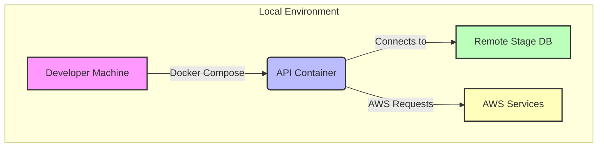
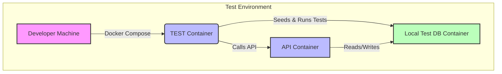

# 🚀 API-Demo

**API-Demo** is a **RESTful web API** that serves as the **primary data service** for a web application.
It demonstrates modern **full-stack development practices**, including backend architecture, API design, database integration, and cloud deployment.

This project showcases how to build **scalable and maintainable web services** using **Node.js, TypeScript, Fastify, and PostgreSQL**, with automated workflows and a developer-friendly environment.

## 🐳 Dockerized Environments

API-Demo uses Docker containers for hosting development and test environments.

It supports:

- **Local API container** connected to remote services (AWS, staging DB)



- **Test API container** connected to a local DB for integration testing or development



### ⚡ Local Environment (Remote Services)

**Requirements**: AWS credentials via AWS SSO. Credentials should be **short-lived** and **not persisted** in shell profile files.

#### One-time setup

```bash
aws configure sso --profile api-demo-stage
```

#### Normal startup flow

```bash
npm run api-down
npm run api-build
npm run api-up-sso
```

The `api-up-sso` command performs AWS SSO login, exports temporary credentials for the process, and starts Docker Compose with those credentials.

Ensure your user account exists on **AWS Identity Center**.

Live databases are protected with **IP whitelist security groups**. Verify your IPv4 at whatismyipaddress.com and provide it to the administrator.

Once started, the API will be accessible at: <http://localhost:6662>

### 🧪 Test Environment

The test environment uses **three Docker containers**:

- **DB Container**: Uses upstream PostGIS image and mounts the demo DB schema from `test/container-db/schema` into `/docker-entrypoint-initdb.d.`
- **API Container**: Hosts the API built from local code.
- **TEST Container**: Seeds the database and runs endpoint integration tests.

#### Setup steps

#### Terminal 1: Build and start DB + API

```bash
npm run ci-down
npm run ci-build
npm run ci-up api
```

Notes:

- Removes existing Docker volumes (required if package.json changes).
- Builds CI API/TEST images and starts DB + API.
- API will be available at <http://localhost:6663>.

#### Terminal 2: Start TEST container

```bash
npm run ci-up test
```

- Rebuilds the test DB, inserts seed data, and executes integration tests.
- Run the command again to repeat tests as needed.
- To run a specific test file, set the TEST_CASE environment variable to the integer prefix of the integration test file:

```bash
TEST_CASE=1 npm run ci-up test
```

----

## Database Library - util/database.js

API-Demo contains a bespoke database interaction library that significantly extends the capabilities of `node-postgres`. This library has two functions, db.query and db.transaction that are exposed as methods on a `db` object decorating the Fastify instance.

`db.query` is for SQL data querying language (DQL)
`db.transaction` for SQL data manipulation language (DML)

These methods return promises and work with JS `async/await`.

Because PG does not allow multiple commands (INSERT/UPDATE/DELETE) in a single prepared statement, the files you provide to `db.query` or `db.transaction` **must** contain a single SQL statement. This keeps the system as modular/normalized as possible and has side effects of DRY: a single, unambiguous, authoritative representation of some DB mutation in the entire system. The files become re-usable and prevent duplication. Multiple operations within a single SQL statement can be supported with Common Table Expressions (CTEs).

Under the hood, the `database.js` library will interpolate named parameters into numerical ones using `node-pg-named`. Files are also passed through a templating system so `<%= some_var %>` will be substituted. However, this is **not** recommended in almost all cases. It does, however, enable one to target child node tables (say, `node.dcd`) using `node.<%= nodeType %>`, which would otherwise be impossible with Prepared Statements since character substitution cannot occur in the table name. Be sure that `nodeType` is sanitized if you choose to use the above method.

### `db.query(fileName, params, outputFormat);`

Calls to `db.query(...)` make use of PG Pooling under-the-hood.

The `db.queryAsync` function is very simple. It simply reads a SQL template file, injects provided parameters, formats a response, and returns the database result.

- `fileName`: the filename relative to the root directory that points at a SQL template file. The file extension is not required.
- `params`: an object literal describing parameters to inject into the fileName SQL template`.
- `outputFormat`: `collection` (defaulted) to return an array of objects or `one` for a single object.

----

#### Example of `db.query(...)` with `outputFormat` = `collection` (return an array of objects)

```sql
--- routes/users/getUsers.sql:
SELECT id, email, first_name, last_name, customer_id FROM public.users WHERE customer_id = $customerId;
```

```javascript
// yourRoute.js:
const users = await this.db.query('routes/users/getUsers', { customerId: 12345 }, 'collection');

// result - users will contain array of objects:
[
  {id: 1, email: 'frodo@semios.com', first_name: 'Frodo', last_name: 'Baggins', customer_id: 12345},
  {id: 2, email: 'bilbo@semios.com', first_name: 'Bilbo', last_name: 'Baggins', customer_id: 12345},
  ...
]
```

----

#### Example of `db.query(...)` with `outputFormat` = `one` (return a *single* object literal)

```sql
--- routes/users/getUser.sql:
SELECT id, email, first_name, last_name, customer_id FROM public.users WHERE user_id = $userId;
```

```javascript
// yourRoute.js:
const user = await this.db.query('routes/users/getUser', { userid: 1 }, 'one');

// result - user will single object:

{id: 1, email: 'frodo@semios.com', first_name: 'Frodo', last_name: 'Baggins', customer_id: 12345},
  
```

----

### `db.transactionAsync(fnParamGroup, dryRun);`

The `db.transaction(...)` function enables you to execute a series of consecutive DML SQL statements as a transaction.  If at any point one of the SQL statements fail, the entire transaction is rolled back leaving the database in a consistent state. Arguments are as follows:

- `fnParamGroup`: An array of objects. Each object represents once set of operations in the SQL transaction and contains two properties (both arrays): `files` and `params`. i.e.

    ```JS
    [
      {
        files: [],
        params: []
      },
      {
        files: [],
        params: []
      },
      ...
    ]
    ```

    The `files` property is an array of file names relative to root (just like `db.query(...)`).

    The `params` object describes parameters to inject into the SQL template(s) identified in `files`. These parameters are passed through `lodash.template` first, and `node-postgres-named` second. Users of `db.transaction` are advised to understand the risks of using template-style variables in the SQL files.

    In the case of only one file, or one parameter, Both `files` and `params` properties can be simplified to a string, and object respectively, instead of arrays.

    Lastly, as a final simplification -- the `fnParamGroup` array can be a single object for cases when groups are not necessary:

    ```JS
    const statements = {
      files:  [
        'node/remove_schedules',
        'node/remove_pheromones',
        'node/remove_rescues',
        'node/remove',
        'node-share/new_history'],
      params: paramsObject
  }
    ```

- `dryRun`: a boolean. If true, will console.log the queries that will run in the transaction, but not execute them. Default is `false`.

----

#### Example of `db.transactionAsync(...)`

```sql
--- routes/customers/removeCustomerUsers.sql
DELETE FROM public.users WHERE customer_id = $customerId;
```

```sql
--- routes/customers/removeCustomer.sql
DELETE FROM public.customers WHERE id = $customerId;
```

```javascript
// yourRoute.js:

await this.db.transaction({
  files: [
    'routes/customers/removeCustomerUsers',
    'routes/customers/removeCustomer'
  ],
  params: { customerID: 12345 }
}, true);

// inspecting log will show the queries since we passed true as dryRun.
```

----

##### `db.transactionAsync's VALUES capability`

Under the hood, the database library will attempt an individual INSERT/UPDATE for every single object inside the params arrays. To perform bulk operations use Postgres' multi-value INSERT/UPDATE capabilities and this will require the use of multiple value `VALUES` statement in the SQL files.

First the JavaScript:

```JS
// yourRoute.js:

await this.db.transactionAsync({
  files: 'mydir/newdata',
  params: [
    { x: 1, y: 'a' },
    { x: 2, y: 'b' }, 
    ...,
    { x: 1337, y: 'w' }
  ]
});
```

Given the above JS, it's suggested to use the following underscore syntax for INSERT/UPDATE when you need to mutate several rows:

```sql
// mydir/newdata.sql.
INSERT INTO some_table (some_x_col, some_y_col) <%= VALUES('x', 'y') %>
```

Note the Underscore function `VALUES` which must be all-caps. Its arguments are the same as if you had called out the $args in the same order without the underscore function.

By using this format the database library will expand your query into:

```sql
INSERT INTO some_table (some_x_col, some_y_col) VALUES ($x_0, $y_0), ($x_1, $y_1), ... ($x_1336, $y_1336);
```

... and perform correct parameter substitution for the `$` variables.

----

### Instance methods and the scope of *this*

When the API starts plugins are registered with the Fastify instance with the Postgres plugin being one of these. This plugin injects Postgres configuration to `node-postgres` (pg), creates and binds a PG pool to `database.query` & `database.transaction` and finally decorates the Fastify instance with a db object exposing `database.query` & `database.transaction` as methods available with `this.db.query/transaction`. This has the advantage of not requiring a `database.js` import wherever DB interaction is needed. The tradeoff is the need for a greater understanding of the value of *this* in terms of local value and propagation.  See <https://developer.mozilla.org/en-US/docs/Web/JavaScript/Reference/Operators/this> for details but in short in order for the instance value of *this* to be propagated *named functions* (not arrow/anonymous) are a requirement, with instance *this*  supplied to child functions with the use of `call()/apply()`.

e.g.

```JS
// routes/users/postLogin.js
const authenticate = require(CWD('util/authenticate'));

async function postLogin(request, reply) {
  const { email, password, level = 0 } = request.body;

  try {
    ...

    // Calls function to authenticate the user. As this is a route handler local this contains the Fastify instance. Use of .call(this, args) sets the value of the called function this to that of the calling this, i.e. containing the decorated instance
    const user = await authenticate.call(this, { email, password, level });

    const customers = await this.db.query('routes/users/postLogin/getUserCustomers', { userId: user.id });
    const groups = await this.db.query('routes/users/postLogin/getUserGroups', { userId: user.id });

    ...
  }
}

module.exports = postLogin;
```

```JS
// util/authenticate.js
async function authenticate({ email, password, level }) {
  ...

  // the value of this in this function is that of the calling function as .call(this, args) was used, otherwise it would be global this or {}
  const user = await this.db.query('util/authenticate/getUser', { email: email.toLowerCase() }, 'one');

  ...
};

module.exports = authenticate;

```
