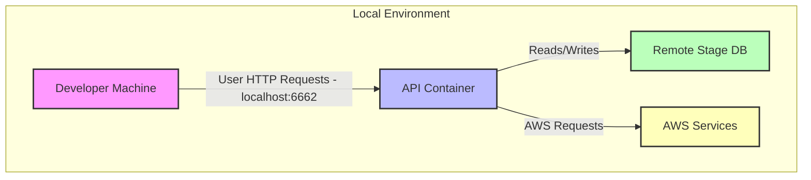
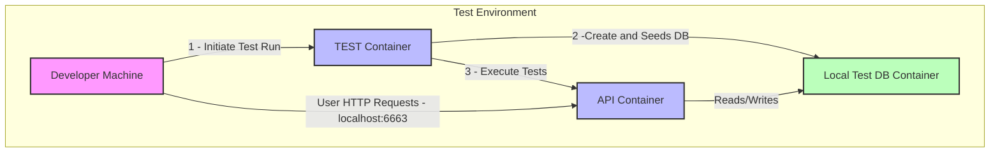

# 🚀 API-Demo

**API-Demo** is a **RESTful web API** that serves as the **primary data service** for a web application.
It demonstrates modern **full-stack development practices**, including backend architecture, API design, database integration and cloud deployment.

This project showcases how to build **scalable and maintainable web services** using **Node.js, TypeScript, Fastify, and PostgreSQL**, with automated workflows and a developer-friendly environment.

## 🐳 Dockerized Environments

API-Demo uses Docker containers for hosting development and test environments.

It supports:

- **Local API container** connected to remote services (AWS, staging DB)



- **Test API container** connected to a local DB for integration testing or development



### ⚡ Local Environment (Remote Services)

**Requirements**: AWS credentials via AWS SSO. Credentials should be **short-lived** and **not persisted** in shell profile files.

#### One-time setup

```bash
aws configure sso --profile api-demo-stage
```

#### Normal startup flow

```bash
npm run api-down
npm run api-build
npm run api-up-sso
```

The `api-up-sso` command performs AWS SSO login, exports temporary credentials for the process, and starts Docker Compose with those credentials.

Ensure your user account exists on **AWS Identity Center**.

Live databases are protected with **IP whitelist security groups**. Verify your IPv4 at whatismyipaddress.com and provide it to the administrator.

Once started, the API will be accessible at: <http://localhost:6662>

### 🧪 Test Environment

The test environment uses **three Docker containers**:

- **DB Container**: Uses upstream PostGIS image and mounts the demo DB schema from `test/container-db/schema` into `/docker-entrypoint-initdb.d.`
- **API Container**: Hosts the API built from local code.
- **TEST Container**: Seeds the database and runs endpoint integration tests.

#### Setup steps

#### Terminal 1: Build and start DB + API

```bash
npm run ci-down
npm run ci-build
npm run ci-up api
```

Notes:

- Removes existing Docker volumes (required if package.json changes).
- Builds CI API/TEST images and starts DB + API.
- API will be available at <http://localhost:6663>.

#### Terminal 2: Start TEST container

```bash
npm run ci-up test
```

- Rebuilds the test DB, inserts seed data, and executes integration tests.
- Run the command again to repeat tests as needed.
- To run a specific test file, set the TEST_CASE environment variable to the integer prefix of the integration test file:

```bash
TEST_CASE=1 npm run ci-up test
```

## 🗄️ Database Library — `src/lib/database.ts`

API-Demo contains a bespoke database interaction library built on top of `node-postgres`. It exposes two methods on a `db` object decorated onto the Fastify instance by the Postgres plugin:

- `db.query` — SQL data query language (DQL): `SELECT`
- `db.transaction` — SQL data manipulation language (DML): `INSERT` / `UPDATE` / `DELETE`

Both methods return promises and work with `async/await`. Each SQL file must contain a **single statement** — this keeps operations modular and reusable and avoids the prepared-statement limitation that prevents multiple DML commands in one call. Multiple operations within a single statement are supported via CTEs.

Named parameters (e.g. `$userId`) in SQL files are transparently interpolated into positional `$1, $2, ...` parameters before being sent to Postgres. Callers always use named parameters.

----

### `db.query<TRow>(file, params, outputFormat?)`

Acquires a connection from the PG pool, reads the SQL file, substitutes named parameters, runs the query, and returns the result. DML keywords (`INSERT`, `UPDATE`, `DELETE`) are **not** permitted in query files — use `db.transaction` instead.

- `file` — absolute path to a `.sql` file (without extension). Use the `cwd` utility to build the path relative to the route directory.
- `params` — `Record<string, unknown>` of named parameters to substitute into the SQL.
- `outputFormat` — `'collection'` (default) returns `TRow[] | null`; `'one'` returns `TRow | null`.
- `TRow` — optional generic for the row shape. Use a pgtyped-generated type for compile-time safety.

Returns `null` when `rowCount` is `0`, regardless of `outputFormat`.

#### Example — `'collection'` (default)

```sql
-- src/routes/users/get-users/get-users.sql
SELECT id, email, full_name FROM public.users WHERE customer_id = $customerId;
```

```ts
import type { IGetUsersResult } from './types/get-users.typed.queries.ts';

const getUsersQuery = cwd('get-users', import.meta.dirname);

const users = await this.db.query<IGetUsersResult>(getUsersQuery, { customerId: 12345 });
// users: IGetUsersResult[] | null
```

#### Example — `'one'`

```sql
-- src/routes/auth/post-login/get-user.sql
SELECT id, email, password_hash FROM public.users WHERE email = $email;
```

```ts
import type { IGetUserResult } from './types/get-user.typed.queries.ts';

const getUserQuery = cwd('get-user', import.meta.dirname);

const user = await this.db.query<IGetUserResult>(getUserQuery, { email }, 'one');
// user: IGetUserResult | null
```

----

### `db.transaction(instructions, dryRun?)`

Executes a series of DML SQL statements as a single atomic transaction. If any statement fails the entire transaction is rolled back, leaving the database in a consistent state.

Returns `Record<string, QueryRow[]>` — a map of file path → flattened result rows across all executions of that file.

- `instructions` — a single instruction object or an array of them. Each instruction has:
  - `files` — a file path string or an array of file path strings.
  - `params` — a params object or an array of params objects (used for bulk operations — see below).
- `dryRun` — if `true`, all statements execute but the transaction is rolled back and a `418` error is thrown. Useful for inspecting what would have run without committing. Default: `false`.

For convenience, a single instruction can be passed directly instead of wrapping it in an array, and `files` / `params` can each be a plain string / object when there is only one.

#### Typing results

Cast each result entry to its pgtyped-generated row type after the call:

```sql
-- src/routes/customers/remove-users.sql
DELETE FROM public.users WHERE customer_id = $customerId RETURNING id;
```

```sql
-- src/routes/customers/remove-customer.sql
DELETE FROM public.customers WHERE id = $customerId RETURNING id;
```

```ts
import type { IRemoveUsersResult } from './types/remove-users.typed.queries.ts';
import type { IRemoveCustomerResult } from './types/remove-customer.typed.queries.ts';

const removeUsersQuery = cwd('remove-users', import.meta.dirname);
const removeCustomerQuery = cwd('remove-customer', import.meta.dirname);

const result = await this.db.transaction([
  {
    files: [removeUsersQuery, removeCustomerQuery],
    params: { customerId: 12345 },
  },
]);

const removedUsers = result[removeUsersQuery] as IRemoveUsersResult[];
const removedCustomer = result[removeCustomerQuery] as IRemoveCustomerResult[];
```

----

#### Bulk operations with `VALUES`

When `params` is an array, the library executes the SQL once per params object by default. To instead perform a single bulk INSERT/UPDATE, use the `<%= VALUES('col1', 'col2') %>` template syntax in the SQL file:

```sql
-- src/routes/data/insert-rows.sql
INSERT INTO some_table (x_col, y_col) <%= VALUES('x', 'y') %>
```

```ts
await this.db.transaction({
  files: insertRowsQuery,
  params: [
    { x: 1, y: 'a' },
    { x: 2, y: 'b' },
    { x: 3, y: 'c' },
  ],
});
```

The library expands this into:

```sql
INSERT INTO some_table (x_col, y_col) VALUES ($x_0, $y_0), ($x_1, $y_1), ($x_2, $y_2);
```

`VALUES` must be all-caps. Its arguments are the parameter key names in the same order as the columns.

----

### 🔗 The `this` context and named functions

The Postgres plugin binds the PG pool to `db.query` and `db.transaction`, then decorates the Fastify instance with the result. Route handlers access `this.db` directly — no import needed.

For `this` to resolve to the Fastify instance, **route handlers must be named `async function` declarations** — arrow functions do not bind `this`. When passing `this` to a helper, use `.call(this, args)`:

```ts
// src/routes/auth/post-login/index.ts
async function postLogin(this: FastifyInstance, request: FastifyRequest, reply: FastifyReply) {
  const user = await this.db.query<IGetUserResult>(getUserQuery, { email }, 'one');

  // Pass the Fastify instance through to a helper with .call(this, ...)
  await someHelper.call(this, user.id);
}
```

```ts
// src/lib/some-helper.ts
async function someHelper(this: FastifyInstance, userId: number) {
  // this.db is available here because the caller used .call(this, ...)
  const rows = await this.db.query(someQuery, { userId });
}
```
