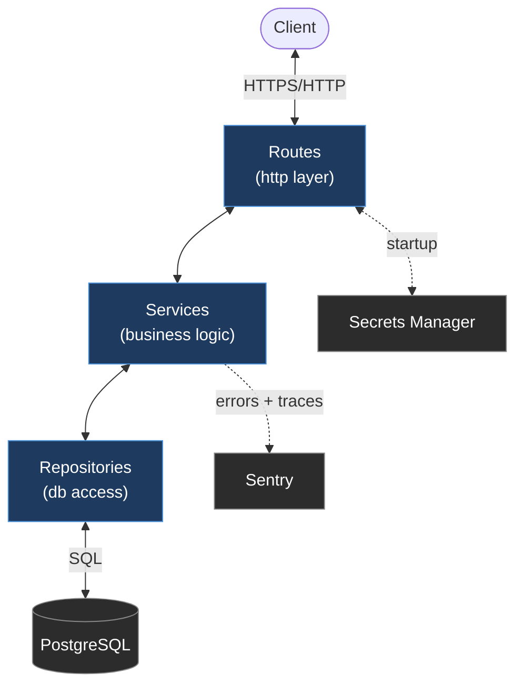
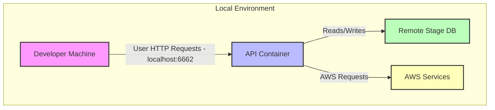
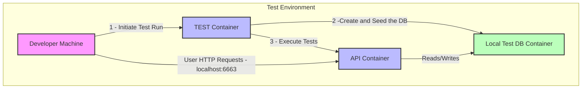

# 🚀 API-Demo

**API-Demo** is a **web API** that serves as the **primary data service** for a web application.

It demonstrates modern **back-end development practices**, including **REST and repository API architecture**, database and external services integration and cloud deployment.

This project showcases how to build a **scalable and maintainable back-end web service** using **Docker, Node.js, TypeScript, Fastify and PostgreSQL**, with automated workflows and developer-friendly development environments.

## 🏛️ Architecture

API-Demo follows **REST principles** and a three-layer **repository architecture** — route handlers, services, and repositories — to separate HTTP concerns, business logic and database access.


```mermaid
flowchart TD
  Client(["Client"])
  Routes["Routes<br/>(http layer)"]
  Services["Services<br/>(business logic)"]
  Repositories["Repositories<br/>(db access)"]
  DB[("PostgreSQL")]
  SEC["Secrets Manager"]
  SENTRY["Sentry"]

  Client <-->|HTTPS/HTTP| Routes
  Routes <--> Services
  Services <--> Repositories
  Repositories <-->|SQL| DB

  Routes <-.->|startup| SEC
  Services -.->|errors + traces| SENTRY

  classDef layer fill:#1e3a5f,stroke:#4a90d9,color:#fff
  classDef ext   fill:#2c2c2c,stroke:#888,color:#fff

  class Routes,Services,Repositories layer
  class DB,SEC,SENTRY ext
```

| Layer | Location | Responsibility |
| --- | --- | --- |
| **Routes** | `src/routes/<resource>/<action>/index.ts` | Route handlers: Parse request, call service, set cookies, send response |
| **Services** | `src/services/<resource>/<resource>.service.ts` | Business logic: orchestration, validation, error decisions |
| **Repository** | `src/repositories/<resource>/<resource>.repository.ts` | DB access only: SQL files, pgtyped types, `db.query` / `db.transaction` |

Services are plain functions with no Fastify or database dependency — they receive a typed repository object (and `jwt` where needed) as parameters. Repositories are created as factories that close over `db`, keeping database infrastructure hidden from the service layer. Handlers access `this.repositories.<domain>` and `this.jwt` and pass them down.

----

## 🔌 API Endpoints

All endpoints are served from the API base URL. Auth endpoints use JWT cookies; protected endpoints require a valid `access_token` cookie.

| Method | Path | Auth | Description |
| --- | --- | --- | --- |
| `POST` | `/login` | — | Authenticate with email + password. Sets `access_token` and `refresh_token` HttpOnly cookies. |
| `POST` | `/refresh` | cookie | Refresh the access token using the `refresh_token` cookie. Issues new cookies. |
| `POST` | `/logout` | cookie | Invalidate the session and clear both cookies. |
| `GET` | `/users` | cookie | Get paginated users. Optional filters: `status`, `user_id`, `page`, `per_page`. |
| `POST` | `/users` | cookie | Create a new user. |
| `DELETE` | `/users/:user_id` | cookie | Delete a user. |
| `PUT` | `/users/:user_id` | cookie | Update a user's full name and known as. |
| `PATCH` | `/users/:user_id/deactivate` | cookie | Deactivate a user. |
| `PATCH` | `/users/:user_id/email` | cookie | Update a user's email address. |
| `PATCH` | `/users/:user_id/invite` | cookie | Invite a user. |
| `DELETE` | `/users/:user_id/invite` | cookie | Cancel a user invitation. |
| `POST` | `/users/activate` | — | Activate an invited user via the activation token and set the account password. |
| `GET` | `/users/roles` | cookie | Get users with their assigned roles. Optional filter: `user_id`. |
| `POST` | `/users/:user_id/roles` | cookie | Assign a user's initial roles (user must have none). |
| `PUT` | `/users/:user_id/roles` | cookie | Replace a user's roles. |
| `DELETE` | `/users/:user_id/roles` | cookie | Remove all of a user's roles. |
| `GET` | `/permissions` | cookie | Get one or more permissions. |
| `POST` | `/permissions` | cookie | Create a permission. |
| `PUT` | `/permissions/:permission_id` | cookie | Update a permission. |
| `DELETE` | `/permissions/:permission_id` | cookie | Delete a permission. |
| `GET` | `/roles` | cookie | Get one or more roles. |
| `POST` | `/roles` | cookie | Create a role. |
| `PUT` | `/roles/:role_id` | cookie | Update a role. |
| `DELETE` | `/roles/:role_id` | cookie | Delete a role. |
| `GET` | `/roles/permissions` | cookie | Get roles with their assigned permissions. |
| `POST` | `/roles/:role_id/permissions` | cookie | Assign a role's initial permissions (role must have none). |
| `PUT` | `/roles/:role_id/permissions` | cookie | Replace a role's permissions. |
| `DELETE` | `/roles/:role_id/permissions` | cookie | Remove all of a role's permissions. |
| `GET` | `/health_db` | — | Database health check. |
| `GET` | `/health_eb` | — | Elastic Beanstalk health check. |

----

## 🐳 Dockerized Environments

API-Demo uses Docker containers for hosting production, development and test environments.

It supports:

- **Local API container** connected to remote services (AWS, staging DB)


```mermaid
flowchart TB
    subgraph Local Environment
        A[Developer Machine]

        A -->|User HTTP Requests - localhost:6662| B[API Container]

        B -->|Reads/Writes| C[Remote Stage DB]
        B -->|AWS Requests| D[AWS Services]
    end

    style A fill:#f9f,stroke:#333,stroke-width:2px
    style B fill:#bbf,stroke:#333,stroke-width:2px
    style C fill:#bfb,stroke:#333,stroke-width:2px
    style D fill:#ffb,stroke:#333,stroke-width:2px
```

- **Test API container** connected to a local DB for integration testing or development


```mermaid
flowchart TB
    subgraph Test Environment
        E[Developer Machine]

        E -->|1 - Initiate Test Run| F[TEST Container]
        E -->|User HTTP Requests - localhost:6663| H[API Container]

        F -->|2 -Create and Seed the DB| G[Local Test DB Container]
        F -->|3 - Execute Tests| H
        H -->|Reads/Writes| G
    end

    style E fill:#f9f,stroke:#333,stroke-width:2px
    style F fill:#bbf,stroke:#333,stroke-width:2px
    style G fill:#bfb,stroke:#333,stroke-width:2px
    style H fill:#bbf,stroke:#333,stroke-width:2px
```

### ⚡ Local Environment (Remote Services)

**Requirements**: AWS credentials via AWS SSO. Credentials should be **short-lived** and **not persisted** in shell profile files.

#### One-time setup

```bash
aws configure sso --profile api-demo-stage
```

#### Normal startup flow

```bash
npm run api-down
npm run api-build
npm run api-up-sso
```

The `api-up-sso` command performs AWS SSO login, exports temporary credentials for the process, and starts Docker Compose with those credentials.

Ensure your user account exists on **AWS Identity Center**.

Live databases are protected with **IP whitelist security groups**. Verify your IPv4 at whatismyipaddress.com and provide it to the administrator.

Once started, the API will be accessible at: <http://localhost:6662>

### 🧪 Test Environment

The test environment uses **three Docker containers**:

- **DB Container**: Uses upstream PostGIS image and mounts the demo DB schema from `test/container-db/schema` into `/docker-entrypoint-initdb.d.`
- **API Container**: Hosts the API built from local code.
- **TEST Container**: Seeds the database and runs endpoint integration tests.

#### Setup steps

#### Terminal 1: Build and start DB + API

```bash
npm run ci-down
npm run ci-build
npm run ci-up api
```

Notes:

- Removes existing Docker volumes (required if package.json changes).
- Builds CI API/TEST images and starts DB + API.
- API will be available at <http://localhost:6663>.

#### Terminal 2: Start TEST container

```bash
npm run ci-up test
```

- Rebuilds the test DB, inserts seed data, and executes integration tests.
- Run the command again to repeat tests as needed.
- To run a specific test file, set the TEST_CASE environment variable to the integer prefix of the integration test file:

```bash
TEST_CASE=1 npm run ci-up test
```

- To run with a V8 coverage report, use the `-c` flag or set `COVERAGE=1`:

```bash
npm run ci-up -- test -c
# or
COVERAGE=1 npm run ci-up test
```

Coverage is collected via Node.js V8 instrumentation and reported using **c8**, scoped to `src/**/*.ts`. The report is printed to stdout at the end of the test run.

----

## 🗄️ Database Library — `src/lib/database/`

API-Demo contains a bespoke database interaction library built on top of `node-postgres`. It exposes two methods on a `db` object decorated onto the Fastify instance by the Postgres plugin:

- `db.query` — SQL data query language (DQL): `SELECT`
- `db.transaction` — SQL data manipulation language (DML): `INSERT` / `UPDATE` / `DELETE`

Internally, the database library is split into focused modules under `src/lib/database/` (imported as `#lib/database` via the folder's `index.ts` entry point):

- `index.ts` — query/transaction orchestration and error flow
- `errors.ts` — error normalization + PG/system-to-HTTP mapping
- `pg-client.ts` and `pg-named.ts` — PG client patching and named-parameter interpolation
- `sql-loader.ts` — SQL file loading with optional environment-aware caching
- `transaction-builder.ts` and `transaction-instruction-flattener.ts` — fluent transaction API and instruction expansion

Both methods return promises and work with `async/await`. Each SQL file must contain a **single statement** — this keeps operations modular and reusable and avoids the prepared-statement limitation that prevents multiple DML commands in one call. Multiple operations within a single statement are supported via CTEs.

Named parameters (e.g. `$userId`) in SQL files are transparently interpolated into positional `$1, $2, ...` parameters by the PG client patch layer before being sent to Postgres. Callers always use named parameters.

SQL files and their pgtyped types live in `src/repositories/<resource>/`. Run `npm run sql:types` after adding or editing any `.sql` file to regenerate types.

----

### `db.query<TRow>(file, params, outputFormat?)`

Acquires a connection from the PG pool, reads the SQL file, substitutes named parameters, runs the query, and returns the result. DML keywords (`INSERT`, `UPDATE`, `DELETE`) are **not** permitted in query files — use `db.transaction` instead.

SQL file text is cached in memory by default only in live environments (`PROD`, `STAGE`) and is not cached by default in `LOCAL`/`TEST`.

- `file` — absolute path to the SQL file **without** the `.sql` extension. The library appends `.sql` internally. Use the `cwd` utility to build the path relative to the repository directory.
- `params` — `Record<string, unknown>` of named parameters to substitute into the SQL. Use the pgtyped-generated `I*Params` interface for compile-time safety.
- `outputFormat` — `'collection'` (default) returns `TRow[] | null`; `'one'` returns `TRow | null`.
- `TRow` — optional generic for the row shape. Use the pgtyped-generated `I*Result` interface for compile-time safety.

Returns `null` when `rowCount` is `0`, regardless of `outputFormat`.

#### Example — `'collection'` (default)

```sql
-- src/repositories/users/get-users.sql
SELECT id, email, full_name, status FROM public.users WHERE status = ANY($status);
```

```ts
// src/repositories/users/users.repository.ts
import type { IUsersGetUsersParams, IUsersGetUsersResult } from './types/get-users.typed.queries.ts';

const getUsersQuery = cwd('get-users', import.meta.dirname);

function createUsersRepository(db: DatabaseDecorator) {
  return {
    getUsers: ({ userId, status, limit, offset }: IUsersGetUsersParams) =>
      db.query<IUsersGetUsersResult>(getUsersQuery, { userId, status, limit, offset }),
      // returns IUsersGetUsersResult[] | null
  };
}
```

#### Example — `'one'`

```sql
-- src/repositories/users/get-user-by-email.sql
SELECT id FROM public.users WHERE email = $email;
```

```ts
// src/repositories/users/users.repository.ts
import type { IUsersGetUserByEmailParams, IUsersGetUserByEmailResult } from './types/get-user-by-email.typed.queries.ts';

const getUserByEmailQuery = cwd('get-user-by-email', import.meta.dirname);

function createUsersRepository(db: DatabaseDecorator) {
  return {
    getUserByEmail: ({ email }: IUsersGetUserByEmailParams) =>
      db.query<IUsersGetUserByEmailResult>(getUserByEmailQuery, { email }, 'one'),
      // returns IUsersGetUserByEmailResult | null
  };
}
```

----

### `db.transaction()`

Returns a `TransactionBuilder` for executing a series of DML SQL statements as a single atomic transaction. If any statement fails the entire transaction is rolled back, leaving the database in a consistent state.

Chain `.add<TRow>(instruction)` for each statement group, then call `.execute(dryRun?)` to run. Results are returned as a positional tuple of row arrays matching the order of `.add()` calls.

- `.add<TRow>(instruction)` — adds one instruction to the transaction. Each instruction has:
  - `files` — a file path string or an array of file path strings.
  - `params` — a params object or an array of params objects (used for bulk operations — see below).
- `.execute(dryRun?)` — runs the transaction. If `dryRun` is `true`, all statements execute but the transaction is rolled back and a `418` error is thrown. Default: `false`.

`files` / `params` can each be a plain string / object when there is only one.

#### Typing results

The generic on `.add<TRow>()` types that position in the result tuple:

```sql
-- src/repositories/customers/remove-users.sql
DELETE FROM public.users WHERE customer_id = $customerId RETURNING id;
```

```sql
-- src/repositories/customers/remove-customer.sql
DELETE FROM public.customers WHERE id = $customerId RETURNING id;
```

```ts
// src/repositories/users/users.repository.ts
import type { IUsersAddUserParams, IUsersAddUserResult } from './types/add-user.typed.queries.ts';

const addUserQuery = cwd('add-user', import.meta.dirname);

function createUsersRepository(db: DatabaseDecorator) {
  return {
    addUser: async ({ email, fullName, knownAs }: IUsersAddUserParams): Promise<{ user: IUsersAddUserResult }> => {
      const [userRow] = await db.transaction()
        .add<IUsersAddUserResult>({ files: [addUserQuery], params: { email, fullName, knownAs } })
        .execute();

      return { user: userRow[0] };
    },
  };
}
```

----

#### Bulk operations with `VALUES`

When `params` is an array, the library executes the SQL once per params object by default. To instead perform a single bulk INSERT/UPDATE, use the `<%= VALUES('col1', 'col2') %>` template syntax in the SQL file:

```sql
-- src/repositories/data/insert-rows.sql
INSERT INTO some_table (x_col, y_col) <%= VALUES('x', 'y') %>
```

```ts
await db.transaction()
  .add({ files: insertRowsQuery, params: [
    { x: 1, y: 'a' },
    { x: 2, y: 'b' },
    { x: 3, y: 'c' },
  ] })
  .execute();
```

The library expands this into:

```sql
INSERT INTO some_table (x_col, y_col) VALUES ($x_0, $y_0), ($x_1, $y_1), ($x_2, $y_2);
```

`VALUES` must be all-caps. Its arguments are the parameter key names in the same order as the columns.

----

### 🔗 The `this` context and named functions

The repositories plugin instantiates each repository factory with `db` and decorates the Fastify instance with the result. Route handlers access `this.repositories.<domain>` and `this.jwt` directly and pass them as arguments to service functions.

**Route handlers must be named `async function` declarations** — arrow functions do not bind `this`. Services and repositories do not use `this`; they receive a repository object and `jwt` as plain parameters.

```ts
// src/routes/auth/post-login/index.ts
async function postLogin(this: FastifyInstance, request: FastifyRequest, reply: FastifyReply) {
  const { email, password } = (request as Request).body;

  // Pass this.repositories.auth and this.jwt — handler has no direct DB access
  const result = await login(this.repositories.auth, this.jwt, { email, password });

  reply.setCookie(...).send(result.user);
}
```

```ts
// src/services/auth/auth.service.ts
async function login(repository: AuthRepository, jwt: JWT, params: LoginParams) {
  // Service calls repository methods — no db, no Fastify coupling
  const user = await repository.getUserByEmail({ email: params.email });
  ...
}
```

```ts
// src/repositories/auth/auth.repository.ts
import type { IAuthGetUserByEmailParams, IAuthGetUserByEmailResult } from './types/get-user-by-email.typed.queries.ts';

function createAuthRepository(db: DatabaseDecorator) {
  return {
    getUserByEmail: ({ email }: IAuthGetUserByEmailParams) =>
      db.query<IAuthGetUserByEmailResult>(getUserQuery, { email }, 'one'),
    // ...
  };
}
```
