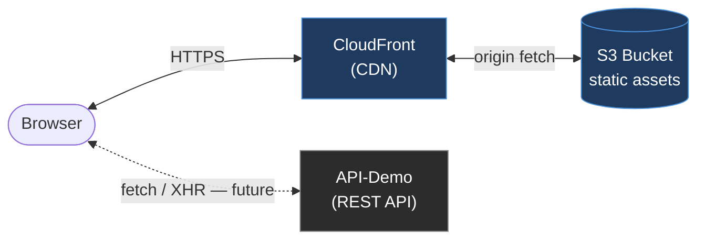

# 🎨 App-Demo

**App-Demo** is the **web front end** for the demo platform — the user-facing tier that a browser loads and runs.

It demonstrates modern **front-end development practices**, including a **type-safe component architecture**, **locally-scoped, type-checked styling**, and **static-site delivery over a CDN**.

This project showcases how to build a **fast, maintainable single-page application** using **React, TypeScript and Vite**, sharing types with the back end and deploying as fingerprinted static assets to **AWS S3 + CloudFront** via automated workflows.

> App-Demo currently presents a **staging landing page**, built on the production-ready stack below so it can grow into the full application UI.

## 🛠️ Tech Stack

| Concern | Choice |
| --- | --- |
| **UI library** | React 19 |
| **Language** | TypeScript (strict, aligned with api-demo) |
| **Build tool / dev server** | Vite 8 (Rolldown) with `@vitejs/plugin-react` (Oxc) |
| **Styling** | Global CSS + CSS Modules, with generated class-name types |
| **Linting** | ESLint (neostandard + `@stylistic`) with React Hooks / Refresh rules |
| **Hosting** | AWS S3 (origin) + CloudFront (CDN) |

----

## 🏛️ Architecture

App-Demo is a **single-page application**. Vite bundles the source into static, content-hashed assets that are served from S3 through CloudFront. The browser runs the app and (in future) calls the [api-demo](../api-demo) REST API directly.



The entry point is `index.html`, which loads `src/main.tsx`; that mounts the React tree into `#root`. There is no server runtime — the deployed artefact is purely static files, so all rendering happens in the browser.

### 📁 Project Structure

```text
app-demo/
  index.html              # SPA entry — loads /src/main.tsx, links the favicon + fonts
  vite.config.ts          # Vite config — React (Oxc) plugin, dev port, #shared alias, __BUILD_ID__
  tsconfig.json           # Solution file — references the app + node projects for `tsc -b`
  tsconfig.base.json      # Shared compiler options (strictness)
  tsconfig.app.json       # Browser project (DOM, JSX, bundler resolution)
  tsconfig.node.json      # Node project (vite.config.ts and tooling)
  eslint.config.ts        # neostandard + @stylistic + React rules
  public/                 # Static assets copied verbatim (favicon)
  src/
    main.tsx              # createRoot(...).render(<App />) — imports global index.css
    App.tsx               # Root component
    App.module.css        # Component styles (locally scoped)
    App.module.css.d.ts   # Generated class-name types (do not edit)
    index.css             # Global styles — design tokens, reset, document defaults
    vite-env.d.ts         # Ambient types — Vite client + the __BUILD_ID__ global
```

----

## ⚡ Local Development

**Requirements**: Node `>=24.8.0`, npm `>=11.6.0` (see `engines` in `package.json`).

```bash
npm install
npm run dev
```

The dev server starts at <http://localhost:5173> with hot module replacement. The port is fixed (`strictPort`) — startup fails loudly if 5173 is already in use rather than silently moving to another port.

### Commands

All commands run from `app-demo/`:

| Command | Purpose |
| --- | --- |
| `npm run dev` | Start the Vite dev server (HMR) at localhost:5173 |
| `npm run build` | Type-check (`tsc -b`) and bundle to `dist/` |
| `npm run preview` | Serve the built `dist/` locally to preview the production bundle |
| `npm run typecheck` | Type-check both TS projects (`tsc -b`) without bundling |
| `npm run lint` | Run ESLint |
| `npm run lint-fix` | Auto-fix lint issues |
| `npm run css:types` | Generate type declarations for `*.module.css` files |
| `npm run css:types:watch` | Regenerate CSS types on change (run alongside `dev`) |
| `npm run css:types:ci` | Verify committed CSS types are up to date (fails on drift) |

> `dist/` is a build artefact — it is git-ignored and produced on demand, never committed. The deployed bundle always comes from a clean CI build.

----

## 🎨 Styling

Styles are split by scope:

- **Global** — `src/index.css` holds design tokens (CSS custom properties), the reset, and `body`/`html` defaults. Imported once in `main.tsx`.
- **Component** — each component has a co-located `*.module.css` ([CSS Modules](https://github.com/css-modules/css-modules)). Class names are locally scoped (hashed at build time), so they cannot collide across components.

```tsx
import styles from './App.module.css';

<div className={styles.card}>…</div>
```

### Type-checked class names

`*.module.css` files are paired with a generated `*.module.css.d.ts` (via [typed-css-modules](https://github.com/Quramy/typed-css-modules)) that types the imported `styles` object with the exact set of class names. A typo such as `styles.crad` is a **compile error**, not a silent `undefined`.

- The declarations are **committed**; regenerate them with `npm run css:types` (or the `css:types:watch` watcher). `css:types:ci` verifies they are current — it runs in CI and the pre-commit hook, not as part of `npm run build`.
- After adding or renaming a class, run `npm run css:types` (or keep `npm run css:types:watch` running during development).

----

## 🔗 Shared Types

App-Demo consumes the top-level [`shared`](../shared) package via the `#shared` alias, kept consistent across the bundler and the type-checker:

- **Vite** — `resolve.alias` in `vite.config.ts`
- **TypeScript** — `paths` in `tsconfig.app.json`

Both map `#shared/*` to `../shared/*` extension-less, so each resolver applies its own `.ts`/`.tsx`/`/index.ts`/asset resolution. `tsconfig.app.json` also lists `../shared` in `include` so those files are part of the type program (without it, a `#shared/*` import resolves but fails type-checking with `TS6307`).

```ts
import type { SomeType } from '#shared/types';
```

----

## ✅ Quality Gates

A shared pre-commit hook (`.githooks/pre-commit`, wired via `core.hooksPath`) runs App-Demo's checks whenever `app-demo/` or `shared/` files are staged, and **aborts the commit on failure**:

1. **`css:types:ci`** — when a `*.module.css` changed, verify the committed declarations are current.
2. **`typecheck`** — full `tsc -b` type-check, including CSS-module class references.
3. **`lint-staged`** — ESLint over the staged files.

The same `lint` + `build` gates run in CI on every pull request.

----

## ☁️ Deployment

On push to `master` touching `app-demo/**`, GitHub Actions builds the bundle **on the runner** (`npm ci && npm run build`) and publishes it:

- **Fingerprinted assets** (`assets/*.[hash].js|css`) are synced to S3 with a long, immutable cache (`max-age=31536000, immutable`).
- **`index.html`** is uploaded with `no-cache`, so new deployments are picked up immediately while hashed assets stay cached.
- The **CloudFront** distribution cache is then invalidated.

Publishing is ordered to avoid a cutover gap: new assets and root static files are uploaded **additively** (no `--delete`) so the currently-live `index.html` keeps resolving everything it references; `index.html` is then swapped in and CloudFront invalidated; only **after** that are superseded assets/root files pruned (`--delete`). A run cancelled mid-deploy therefore leaves, at worst, stale files lingering — never a missing-asset state.

Because the build runs in CI, no compilation happens on a developer machine for production, and `dist/` never needs to exist locally or in version control.

### Follow-ups

- **SPA deep-link routing.** The app is currently a single page, so every request maps to a real S3 object. Once **client-side routing** is added, deep links / refreshes on a route (e.g. `/users/123`) will hit CloudFront → S3, find no object, and error. Before shipping routing, configure CloudFront to serve `index.html` for those misses. Notes for that work:
  - Map **both 403 and 404** → `/index.html` (a REST-origin + OAC bucket typically returns **403 AccessDenied**, not 404, for a missing key).
  - Prefer a **CloudFront Function** (viewer-request) that rewrites only extension-less / navigation paths, rather than a blanket error-response rewrite — a catch-all `404 → 200 /index.html` masks genuinely missing **assets** (e.g. a pruned hashed chunk), returning HTML for a `.js` request and causing a confusing MIME/parse error. Keep the error-response caching TTL low.
  - This is **infrastructure**, not app code: the CloudFront distribution lives outside this repo (referenced only via the `APP_DEMO_CLOUDFRONT_DISTRIBUTION_ID` CI variable), so it ships as a deploy/infra change, not a code change here.
