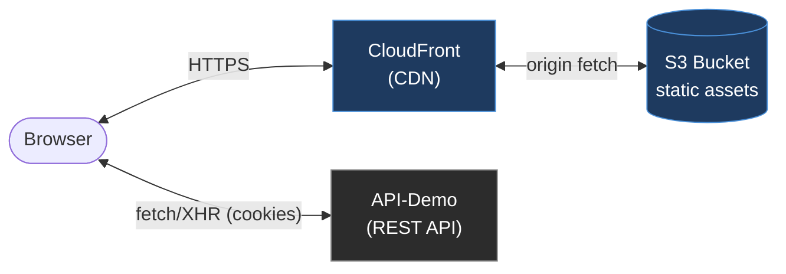

# 🎨 App-Demo

**App-Demo** is the **web front end** for the demo platform — the user-facing tier that a browser loads and runs and the UI for the [api-demo](../api-demo) REST API.

It demonstrates modern **front-end development practices**: a type-safe component architecture, cookie-based authentication against the API, client-side routing with guarded routes, automated component tests backed by a mock API generated from the API's own OpenAPI schema, front-end error/performance monitoring and static-site delivery over a CDN.

> The app currently implements the **authentication flow** — a `/login` screen, self-service password reset (`/password-forgot`, `/password-reset`), and a guarded `/home` — and is structured to grow into the full application UI.

## 🛠️ Tech Stack

| Concern | Choice |
| --- | --- |
| **UI library** | React 19 |
| **Language** | TypeScript (strict, aligned with api-demo) |
| **Build tool / dev server** | Vite 8 (Rolldown) with `@vitejs/plugin-react` (Oxc) |
| **Routing** | TanStack Router (code-based, guarded routes) |
| **Server state / data fetching** | TanStack Query |
| **HTTP client** | Axios (cookie auth, transparent token refresh) |
| **UI components** | Ant Design 6 (`antd`) + `@ant-design/icons` |
| **Monitoring** | Sentry (`@sentry/react`) — errors, Web Vitals, distributed tracing |
| **Testing** | Vitest + React Testing Library + MSW (schema-derived mock) |
| **Styling** | Ant Design theme + CSS Modules (type-checked class names) |
| **Linting** | ESLint (neostandard + `@stylistic`) with React Hooks / Refresh rules |
| **Hosting** | AWS S3 (origin) + CloudFront (CDN) |

----

## 🏛️ Architecture

App-Demo is a **single-page application**. Vite bundles the source into static, content-hashed assets served from S3 through CloudFront. The browser runs the app and calls the api-demo REST API directly, authenticating via **HttpOnly cookies**.



`index.html` loads `src/main.tsx`, which mounts the provider tree — `QueryClientProvider` → antd `ConfigProvider`/`App` → `Sentry.ErrorBoundary` → `RouterProvider`. There is no server runtime; the deployed artefact is purely static files.

### 🔐 Authentication

The API sets **HttpOnly** `access_token` / `refresh_token` cookies that JavaScript cannot read, so the app never touches the tokens directly:

- **`src/lib/api-client.ts`** — one axios instance with `withCredentials: true` (the browser attaches the cookies automatically) and a single-flight **401 → `POST /refresh` → retry** interceptor, so an expired access token is transparently renewed.
- **Session hydration** — because the cookies are unreadable, the app learns who is logged in by calling **`GET /me`**. A readable `localStorage` "logged-in hint" (`src/features/auth/session.ts`) lets a cold, logged-out load skip the `/me` probe entirely and go straight to `/login`.
- **Guarded routes** — each route's `beforeLoad` resolves the session; `/home` redirects to `/login` when unauthenticated, `/login` redirects to `/home` when authenticated.
- **Password reset** — `/password-forgot` requests the email; `/password-reset` reads the `?token=` from the emailed link, and its `beforeLoad` validates the token against the API (`POST /password/reset/validate`) so a used or expired link redirects to `/login` instead of showing a dead form. A live strength meter (`PasswordStrengthMeter`) mirrors the API's policy — composition rules plus a minimum [zxcvbn](https://github.com/zxcvbn-ts/zxcvbn) score, with zxcvbn lazily loaded into its own chunk — and the API re-enforces it on submit.
- **Permissions** come from the access-token claim (returned on `/login` and `/me`) and drive UI — never security. The API is always the enforcement boundary.

### 📁 Project Structure

```text
app-demo/
  index.html               # SPA entry — loads /src/main.tsx
  vite.config.ts           # React plugin, #shared alias, __BUILD_ID__, guarded Sentry source-map plugin
  vitest.config.ts         # Test config — jsdom, #shared alias, setup files
  tsconfig.*.json           # Solution + app (browser) + node projects
  eslint.config.ts          # neostandard + @stylistic + React rules
  .env.development          # env:local  → local API :6662 (Sentry LOCAL)
  .env.test                 # env:test   → test API :6663 (Sentry off)
  .env.stage                # deploy build → stage API (Sentry STAGE)
  src/
    main.tsx               # providers + Sentry init + error boundary + document title
    env.d.ts               # ImportMetaEnv (VITE_API_URL, VITE_SENTRY_*) + __BUILD_ID__
    index.css              # minimal global reset (box-sizing, body margin)
    app/
      router.ts            # code-based route tree + createRouter (exports routeTree for tests)
      query-client.ts      # shared QueryClient
    routes/                # root / login / home / password-forgot / password-reset defs + beforeLoad guards
    pages/                 # LoginPage, HomePage, PasswordForgotPage, PasswordResetPage
    components/            # shared presentational components (PermissionsList, PasswordStrengthMeter)
    features/auth/         # api calls, me query, session hint, use-login / use-logout / use-auth / use-password-*
    lib/
      api-client.ts        # axios instance + 401→refresh interceptor
      env.ts               # API_BASE_URL + headers, env label + build id (VITE_API_URL required in prod)
      password-policy.ts   # shared password rules + lazily-loaded zxcvbn scorer
      sentry.ts            # Sentry init + setSentryUser
    mocks/                 # test mock API: openapi.ts (generated), handlers, server
    test/                  # Vitest setup + renderApp harness
```

----

## ⚡ Local Development

**Requirements**: Node `>=24.8.0`, npm `>=11.6.0` (see `engines` in `package.json`).

This package is an [npm workspace](../README.md) — run `npm install` **once at the repo root** to install every workspace against the single root lockfile (there is no per-package install).

The dev server runs at <http://localhost:5173> (fixed `strictPort`) with HMR. Pick the command for the API you're running:

```bash
npm install               # run once at the repo root

npm run env:local         # dev against the LOCAL API (:6662, api-up-sso) — Sentry active as LOCAL
npm run env:test          # dev against the TEST API  (:6663, ci-up api) — Sentry off
```

The API's CORS already allow-lists `http://localhost:5173`.

### Commands

All commands run from `app-demo/` (or from the repo root with `-w app-demo`):

| Command | Purpose |
| --- | --- |
| `npm run env:local` | Dev server against the local API (`:6662`) |
| `npm run env:test` | Dev server against the test API (`:6663`) |
| `npm run build` | Type-check (`tsc -b`) and bundle to `dist/` (`vite build --mode stage`) |
| `npm run preview` | Serve the built `dist/` locally |
| `npm run typecheck` | Type-check both TS projects (`tsc -b`) |
| `npm run test` | Run the Vitest suite once |
| `npm run test:watch` | Run Vitest in watch mode |
| `npm run openapi:types` | Regenerate the mock API types from `shared/openapi.json` |
| `npm run lint` / `lint-fix` | Run / auto-fix ESLint |
| `npm run css:types` / `:watch` / `:ci` | Generate / watch / verify `*.module.css` type declarations |

> `dist/` is a git-ignored build artefact, produced on demand — the deployed bundle always comes from a clean CI build.

### Environments & config

Each dev/deploy target is a Vite mode with a committed `.env.<mode>` file exposing `VITE_API_URL` (and, where Sentry is active, `VITE_SENTRY_*`):

| Command / build | Vite mode | `.env` file | API | Sentry env |
| --- | --- | --- | --- | --- |
| `env:local` | development | `.env.development` | `localhost:6662` | `LOCAL` |
| `env:test` | test | `.env.test` | `localhost:6663` | off |
| `npm run build` (deploy) | stage | `.env.stage` | stage API | `STAGE` |

A production build **requires** `VITE_API_URL` — `src/lib/env.ts` throws rather than ship a localhost fallback (verified via `import.meta.env.PROD` dead-code elimination).

----

## ✅ Testing

Automated **component / integration tests** with **Vitest + React Testing Library**, running the real router/query/providers via the `renderApp` harness (`src/test/render.tsx`) with the API mocked by **MSW** — no browser or Docker required. They run in CI on every PR.

The mock API can't silently drift from the real API because it's derived from the API's **OpenAPI schema**:

```text
api-demo route schemas ──openapi:generate──▶ shared/openapi.json ──openapi:types──▶ src/mocks/openapi.ts ──▶ typed handlers
```

- **`src/mocks/handlers.ts`** is a hybrid: an auto-generated **baseline** for every endpoint (`@mswjs/source` `fromOpenApi`, responses from the schema `example`s) plus a few **type-safe overrides** (`openapi-msw`) for the endpoints tests assert on. A contract change (e.g. `id → user_id`) breaks the mock at `tsc`.
- The default `mockUser` is an **admin** whose permissions come from the spec's `x-permissions` (collected from the route configs), so it stays current as routes grow.
- Regenerate after an API schema change: `npm run openapi:generate -w api-demo && npm run openapi:types -w app-demo`. CI fails the build if the committed spec/types are stale (see the [CI/CD workflows](../README.md#-cicd-workflows)).

The real API contract (status codes, cookie/CORS behaviour) is owned by api-demo's own integration tests — there is deliberately no browser E2E here, which would just re-test the API.

----

## 👁️ Monitoring (Sentry)

`@sentry/react` provides error capture, Web Vitals, and **distributed tracing** that links front-end actions to api-demo's server traces (both tiers report the same user). Initialised in `main.tsx` before render; see `src/lib/sentry.ts`. Sentry is **off unless a DSN is present** (active in `env:local` as `LOCAL` and in the deploy as `STAGE`; off in `env:test`). Trace headers are attached only to the API origin, and a `dataCollection` block keeps request bodies (notably the login password), cookies, and IP out of Sentry. Source maps upload on deploy when the `APP_DEMO_SENTRY_*` CI credentials are set.

----

## 🎨 Styling

Ant Design components (themed via `ConfigProvider`) cover most UI; **CSS Modules** (`*.module.css`) handle custom layout, with class names locally scoped and **type-checked**. Each `*.module.css` is paired with a generated, committed `*.module.css.d.ts` ([typed-css-modules](https://github.com/Quramy/typed-css-modules)) so a typo like `styles.crad` is a compile error. Regenerate with `npm run css:types` (or keep `css:types:watch` running); `css:types:ci` verifies they're current in CI and the pre-commit hook.

----

## 🔗 Shared Types

App-Demo consumes the top-level [`shared`](../shared) package via the `#shared` alias, kept consistent across the bundler and the type-checker:

- **Vite** — `resolve.alias` in `vite.config.ts` (and `vitest.config.ts`)
- **TypeScript** — `paths` in `tsconfig.app.json`, which also lists `../shared` in `include`

```ts
import type { InternalUser, Login, PasswordForgot, PasswordReset } from '#shared/types';
```

`shared/types.d.ts` is a declaration file (types only), imported by both app-demo and api-demo so a contract change breaks both at `tsc`. The generated OpenAPI spec lives alongside it at `shared/openapi.json`.

----

## 🚦 Quality Gates

A shared pre-commit hook (`.githooks/pre-commit`, wired via `core.hooksPath`) runs App-Demo's checks when `app-demo/` or `shared/` files are staged and **aborts the commit on failure** (`css:types:ci` when CSS changed, `typecheck`, and `lint-staged`).

On every pull request, CI runs the front-end checks and verifies the mock's spec/types stay in sync with the API — see the [CI/CD workflows](../README.md#-cicd-workflows).

----

## ☁️ Deployment

On push to `master` touching `app-demo/**`, GitHub Actions builds the bundle **on the runner** — `npm ci` at the repo root then `npm run build -w app-demo` (`vite build --mode stage`, loading `.env.stage`) — and publishes it:

- **Fingerprinted assets** (`assets/*.[hash].js|css`) sync to S3 with a long immutable cache (`max-age=31536000, immutable`).
- **`index.html`** uploads with `no-cache`, so new deployments are picked up immediately while hashed assets stay cached.
- The **CloudFront** distribution cache is invalidated.

Publishing is ordered to avoid a cutover gap: new assets and root files upload **additively** (no `--delete`) so the live `index.html` keeps resolving everything it references; `index.html` is then swapped in and CloudFront invalidated; only **after** that are superseded files pruned (`--delete`). A run cancelled mid-deploy leaves, at worst, stale files lingering — never a missing-asset state.

### SPA deep-link routing

The app has **client-side routing** (`/login`, `/home`, `/password-forgot`, `/password-reset`), so a deep link or refresh on a route hits CloudFront → S3, finds no object, and errors. CloudFront is configured to serve `index.html` for those misses so the router can take over.

- **Configured:** CloudFront **custom error responses** map **both 403 and 404** → `/index.html` with response code **200**. A REST-origin + OAC bucket returns **403 AccessDenied** (not 404) for a missing key — because the bucket policy grants `s3:GetObject` but not `s3:ListBucket` — so mapping **403** is the one that actually fixes the refresh error.
- **Trade-off:** this blanket rewrite also masks genuinely missing **assets** (e.g. a pruned hashed chunk), returning HTML with a 200 for a `.js` request and causing a confusing MIME/parse error. The cleaner long-term alternative is a **CloudFront Function** (viewer-request) that rewrites only extension-less / navigation paths, leaving real asset 403/404s intact.
- This is **infrastructure**, not app code: the CloudFront distribution lives outside this repo (referenced only via the `APP_DEMO_CLOUDFRONT_DISTRIBUTION_ID` CI variable), so this setting is **not version-controlled** and won't be recreated automatically if the distribution is rebuilt.
